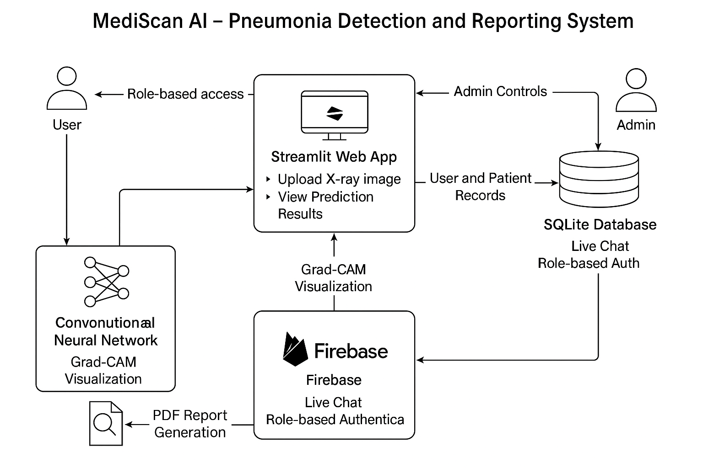

# 🩺 MediScan AI – Pneumonia Detection and Reporting System

MediScan AI is a full-stack medical diagnostic web application that uses deep learning to detect pneumonia from chest X-ray images. Built with **Streamlit**, **Firebase**, and **SQLite**, the system enables secure, real-time diagnosis and report generation — making it an ideal solution for impact-driven domains like **Healthcare Tech**.


## 🚀 Features

### 🔍 Pneumonia Detection with Explainability
- Upload single or multiple chest X-ray images.
- Real-time AI predictions using **Convolutional Neural Networks (CNN)**.
- **Grad-CAM visualization** for transparency in predictions.

### 👤 Role-Based Access Control (RBAC)
- **Doctor**: Can upload X-rays, view patient history, and generate reports.
- **Patient**: Can view personal diagnosis history and reports.
- **Admin**: Manages users, duplicates, and all system-level operations.

### 🗨️ Doctor-Patient Messaging System
- Built-in real-time **chat interface** for doctor-patient communication.
- Each message is stored in **Firebase Realtime Database**.
- Access controlled via user roles.

### 📑 Auto-generated Reports
- Downloadable **PDF reports** with:
  - Prediction results
  - Doctor's notes
  - Patient details
  - X-ray image and Grad-CAM

### 📊 Analytics Dashboard
- Dynamic graphs using **Plotly**.
- X-ray classification stats and system usage trends.


## 🛠️ Tech Stack

| Layer        | Technology                             |
|--------------|-----------------------------------------|
| Frontend     | Streamlit (Python-based)                |
| Backend      | Python · Flask-style APIs inside Streamlit |
| ML           | CNN · Grad-CAM · Keras · TensorFlow     |
| Auth & DB    | Firebase Authentication + Realtime DB   |
| Local DB     | SQLite (for history and reports)        |
| PDF Reports  | Python's ReportLab + Pillow             |
| Messaging    | Firebase Realtime DB                    |
| Charts       | Plotly                                  |


## 🔐 Role-Based Access Flow

| Role    | Access Permissions                                                                 |
|---------|--------------------------------------------------------------------------------------|
| Patient | View own reports, chat with doctor                                                  |
| Doctor  | Upload X-rays, write diagnosis, chat with patient, generate reports                 |
| Admin   | View/delete all users, prevent duplicates, oversee system logs and chat moderation  |


## 🗺️ System Architecture




## 📁 Folder Structure
```bash
📦 MediScan-AI
├── 📁 model/ # CNN Model + Grad-CAM
├── 📁 app/
│ ├── main.py # Streamlit app logic
│ ├── auth.py # Firebase login/signup
│ ├── report.py # PDF generation
│ ├── dashboard.py # Analytics with Plotly
│ ├── chat.py # Doctor-Patient chat interface
│ └── utils.py # Helper functions
├── 📁 static/ # Images and Grad-CAM outputs
├── 📁 templates/ # Custom HTML components
├── 📄 requirements.txt
└── 📄 README.md
```


## 🧪 How to Run Locally

1. **Clone the repository**  
   ```bash
   git clone https://github.com/saksham-0425/MediSan-AI
   cd MediSan-AI
2. **Create virtual environment & activate**
   ```bash
   python -m venv venv
   source venv/bin/activate
    or
   venv\Scripts\activate #on Windows
   ```
3. Install dependencies
   ```bash
   pip install -r requirements.txt
   ```
4. Run Streamlit app
   ```bash
   streamlit run app/main.py
   ```
## 📜 License
MIT License – feel free to use, fork, or contribute!

## Contact
- guptasaksham2510@gmail.com
- https://github.com/saksham-0425
- https://www.linkedin.com/in/saksham-gupta-894400246/
